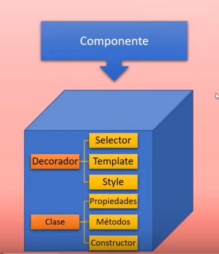

# 1. Introducción Angular

## Temario

1. ¿Que es angular?
2. Instalación de Angular y software necesario
3. Creación de primera aplicación
4. Estructura de aplicación de Angular
5. Creación de componentes
6. Binding
7. Directivas de utilidad
8. Forms
9. Comunicación
10. Servicios
11. Routing
12. Http y autenticación
13. Despliegue de aplicaciones

El temario puede ir variando a medida de que avanza el curso

## Requisitos Previos

- Requisitos minimos
    - Conocimiento básico-medio de JavaScript

- Requisitos deseados
    - Conocimientos medio-avanzado de JavaScript

## Angular

### ¿Que es?
Es un framework que sirve para crear aplicaciones web SPA(Single Page Application), desarrollado por google

### ¿Que caracteristicas tiene?
- Separa front-end y back-end de la aplicación (Lo separa de una forma muy clara)
- Simplifica el código
- Sigue el patron MVC
- Basado en componentes
- Es de código abierto
- Utiliza el lenguaje **TypeScript** que es una mejora de **JavaScript**

### TypeScript
Es una mejora de JavaScript, con una orientación a objetos muy fuerte

## ¿Porque utilizar Angular?

- El desarrollo de aplicaciones web es rápido y la navegación por ellas también

- Es modular (Reutilizable) Cosas que haces para una aplicación la puedes reutilizar para otra

- Es de Facil Mantenimiento

- Es Multiplataforma

- Futuro Estable

- Gran soporte de herramientas

- Tiene una creciente demanda en el mercado

# 2. Instalación software & Primera App

## Instalación del software necesario

### 1. Node.js
Entorno de JS en tiempo de ejecución del lado del SERVIDOR

### 2. NPM (Node package manager)
Es el administrador de paquetes de **Node.Js**

### 3. Angular
Angular CLI (Command Line Interface), Muchas de las funcionalidades de angular lo haremos desde la linea de comandos y necesitaremos esta herramienta.

- Para instalar esta herramienta vamos a ir a Angular CLI y seguir el paso de los comandos

### 4. Editor de codigo
El curso se realizara en Visual Studio Code

### 5. Git(Opcional)
Es recomendable pero no imprescindible

## Creación de mi primera app

1. Creamos una carpeta en el PC donde almacenar la aplicación

2. Abrimos la consola de comandos 

3. Nos dirigimos hasta la ruta de la carpeta que creamos 

4. Una vez en la ruta correcta, ejecutamos el siguiente comando `ng new nombreDeLaApp`

5. Nos va a hacer una serie de preguntas
    - ¿Queremos forzar la codificación estricta? R: Por buenas practicas es bueno decir **SI**

    - ¿Queremos agregar Angular Routing? R: Mas adelante veremos Angular Routing, por el momento le decimos que **NO**

    - ¿Que formato de hoja estilo queremos? R: El que nosotros deseemos

6. Va a comenzar la instalación de todos los paquetes, esperamos a que termine

7. Una vez termine tendremos en la carpeta que creamos, una subcarpeta con el nombre de la app y TODOS los archivos necesarios para comenzar a trabajar con el Framework de Angular

8. Ya hemos creado nuestro proyecto

## Ejecutar nuestra aplicación

1. Despues de creada nos dirigimos a la carpeta donde tenemos nuestro proyecto desde **la consola de comandos (CMD)**

2. Para esto abrimos la consola de comandos que prefiramos (la mas común es CMD) y colocamos `cd` y la ruta de la carpeta donde se encuentra nuestro proyecto. **EJ:** `cd D:\Developer\curso_angular_pildoras_inf\primera_app\miprimeraApp`

3. Una vez dentro de la carpeta donde esta el proyecto ejecutamos el siguiente comando `ng serve --open`

4. Una vez ejecutado el comando, se abrira la aplicación en el navegador en el `localhost:4200` y nos muestra la bienvenida de Angular

5. Ya hemos ejecutado nuestra aplicación

# 3. Estructura de la app

1. Volvemos a levantar/ejecutar nuestra app con el comando `ng serve -o`

2. Para DETENER el servidor lo ponemos terminar con el atajo `ctrl + C`

## Estructura de una aplicación de angular

A excepción de la **carpeta SRC**, el resto de archivos y carpetas solo se utilizan durante el **DESARROLLO** de la aplicación, es decir mientras estamos contruyento la APP en nuestra maquina.

En modo **PRODUCCIÓN**, es decir cuando la aplicación ya este terminada y queramos desplegar la app en un servidor lo UNICO que necesitaremos será la carpeta **SRC** (Source)

Todo aquello que debemos modificar para construir nuestra aplicación con Angular esta en la carpeta **SRC**, el resto de archivos y carpetas son archivos de configuración de Angular que son unicamente necesarios durante el desarrollo

## Dentro de la carpeta SRC

### Index.html
Aquí dentro podremos encontrar el `index.html` de esa pagina de Bienvenida de Angular que vemos cuando iniciamos el servidor.

Si analizamos el HTML no tenemos absolutamente nada de lo que vemos en la pagina, lo unico diferente a la estructura del HTML es la etiqueta `<app-root></app-root>` que se encuentra dentro del `body`

Esta etiqueta `<app-root></app-root>` lo que hace es CARGAR COMPONENTES y hace referencia *(apunta como si fuera una ruta)* a la carpeta `app` que esta dentro de `src`

### app (Carpeta)
Dentro de esta subcarpeta de `src` tenemos: 

1. Una hoja de estilos CSS
2. Un archivo HTML
3. Tres Archivos con Extensión `.ts` TypeScript

**NOTA: Recordemos que la base de cualquier aplicación Angular son los componentes** 

#### app.component.html

Si dentro de esta carpeta app abrimos el archivo HTML llamado `app.component.html` observamos que es un archivo enorme de HTML *(Que incluso tiene CSS embebido dentro del HTML)*, pues este archivo es el codigo de lo que vemos en el navegador **La pagina de bienvenida de Angular**

## Conclusión

1. Desde el `index.html` de la carpeta `src` lo que estamos haciendo es cargar componentes, que es lo que significa esa etiqueta extraña

2. Este componente inicial que carga lo tenemos en la carpeta `app` el cual lo modificamos y borramos todo; menos un `span` que contenia el titulo de la app (Esto lo hicimos en el archivo `app.component.html`)

# 4. Estructura y flujo de ejecución de la App

Toda aplicación Angular es de tipo SPA, es decir se trata de una unica pagina web.

Este tipo de aplicaciones tienen una difencia fundamental respecto a las aplicaciones Web tradicionales (Las que no son SPA)

## Aplicaciones Tradicionales(NO SPA)

- Lo primero que ocurre en este tipo de aplicaciones es que el cliente envia una **Petición inicial** y se le responde con un archivo **HTML** que cargara en el navegador del cliente (Hasta aquí no hay ninguna diferencia con las apliciones SPA) 

- La **DIFERENCIA FUNDAMENTAL** viene en que las aplicaciones **NO SPA**, cada vez que realizamos acciones como pulsar botones, enviar formularios, desplegar menús, ETC.... Esta aplicación lo que hace es enviar **MAS PETICIONES** al servidor y el servidor se encarga de enviarle **MAS ARCHIVOS HTML** como respuesta a esas peticiones.

    - Cada operación que realizamos, el servidor nos envia un HTML como respuesta, asi que estamos cargando constantemente html, de principio a fin.

## Aplicaciones SPA

- Lo primero que ocurre en este tipo de aplicaciones es que el cliente envia una **Petición inicial** y se le responde con un archivo **HTML** que cargara en el navegador del cliente (Hasta aquí no hay ninguna diferencia con las apliciones NO SPA) 

- La **DIFERENCIA FUNDAMENTAL** viene en que despues de esta carga del archivo html por la petición inicial, **NUNCA MAS** volvemos a cargar otro **archivo HTML** entero en nuestro navegador.
    - Nunca tendremos que actualizar o recargar la pagina, esta en cambio se va modificando y actualizando por zonas, en función al contenido que queramos mostrar


**EJEMPLO**
- Al utilizar google maps nosotros cargamos el mapa una UNICA vez y cuando requerimos saber información sobre lugares, rutas o restaurantes, solo nos muestra ESA información que le pedimos SIN NECESIDAD de recargar la pagina de nuevo, simplemente nos muestra encima del mapa los elementos que le estamos pidiendo. (No se nos envian varios HTML para cada operación)

Es asi como funciona basicamente una aplicación Angular o SPA, esto se hace gracias a la utilización de **AJAX**

Cada vez que el usuario realiza una acción se envia una petición mediante AJAX al Servidor y este devuelve un archivo **JSON(JavaScript Object Notation)**

Basicamente este seria el proceso de una aplicación Angular.

**NOTA: JSON es un documento de texto con una notación como de diccionario que funciona para poder intercambiar datos entre cliente y servidor**

## Estructura y flujo de ejecución


### 1.1 App Angular:
 Cuando nosotros cargamos una aplicación Angular esta lo que hace es buscar una función que se considera la función principal de la aplicación que lleva el nombre de `main`.

- La podemos encontrar dentro de la carpeta `src` y en un archivo TypeScript `main.ts`

### 1.2 main.ts: 
En esta función `main` encontramos la definición del modulo principal (modulo raiz) que se debe de cargar
```ts
import { enableProdMode } from '@angular/core';
import { platformBrowserDynamic } from '@angular/platform-browser-dynamic';

// Aca se importa el modulo raíz desde la ruta (from './app/app.module')
import { AppModule } from './app/app.module';
import { environment } from './environments/environment';

if (environment.production) {
  enableProdMode();
}

// Aca se especifica que este es el modulo raiz (AppModule)
platformBrowserDynamic().bootstrapModule(AppModule)
  .catch(err => console.error(err));
```
### 2. Modulo raiz (AppModule) 

Este modulo raiz viene definido en el archivo `app.module.ts` que se encuentra en la carpeta `app` que a su vez se encuentra en la carpeta `src` es decir la ruta del archivo es `src/app/app.module.ts`

Este modulo raiz se encarga de la definición del Componente Principal que se debe cargar `AppComponent`

    NOTA: Recordemos que la unidad basica de una aplicación Angular son los COMPONENTES
```ts
import { NgModule } from '@angular/core';
import { BrowserModule } from '@angular/platform-browser';

// Importa el AppComponent
import { AppComponent } from './app.component';

// Aca se crea cual el modulo, que apunta a su vez al componente principal a cargar
@NgModule({
  declarations: [
    AppComponent
  ],
  imports: [
    BrowserModule
  ],
  providers: [],
//   Aca define el componente a cargar
  bootstrap: [AppComponent]
})
// Este es el nombre del modulo raiz, aca se define el nombre de (AppModule)
export class AppModule { }
```
### 3. AppComponent
AppComponent es el nombre que recibe el componente principal por defecto de una aplicación de Angular. y esta alojado en `src/app/app.component.ts`

Este componente tiene es su interior la definición de una CLASE, y la definición de un DECORADOR

    Los DECORARES son codigo JS que permiten añadir anotaciones, metadatos y ESPECIFICA el comportamiento que va a tener la clase a la que acompañan

```js
// Aca se crea el componente AppComponent
import { Component } from '@angular/core';

// Aca tenemos el DECORADOR del componente (Asi se crea un decorador)
@Component({
//   Este DECORADOR
  // Tiene definido el selector que carga el componente
  selector: 'app-root',
  // Tiene definido el archivo HTML donde esta cargado este componente   
  templateUrl: './app.component.html',
  // Tiene definido una hoja de estilos que le da estilos a este componente   
  styleUrls: ['./app.component.css']
})
// Aqui tenemos definida la clase del componente
export class AppComponent {
  // Dentro de la clase tenemos esto que se conoce como un atributo 
  title = 'miprimeraApp';
}
```
Estos Archivos que se especifican en el Decorador de `AppComponent` Tambien se encuentran en la carpeta `src/app/`

## Atributos (Propiedades)

Por otro lado las propiedades de nuestros componentes son las que tenemos en la clase de este mismo componente (Algo asi como una variable) si necesitamos utilizar propiedades, lo unico que debemos hacer es definir la propiedad dentro de la CLASE del componente y luego utilizarla entre llaves

**CLASE DEL COMPONENTE**

```ts
export class AppComponent {
  // Dentro de la clase del componente podemos definir las propiedades que queramos
  title = 'miprimeraApp';
  unSaludo = 'Holaaa'
}
```
**UTILIZACION DE ATRIBUTOS**
```html
<!-- Aca podemos hacer uso de las propiedades(atributos) que definamos las veces que queramos -->
<span class="title">{{Saludo}} {{ title }} Esta ejecutandose y sera una gran app</span>
```
## Extensiones recomendadas para instalar
- Angular Language Services
- Angular Files

# 5. Componentes

Veremos la creación de componentes en Angular.

Recordemos que el componente que vimos la clase anterior `AppComponent` era el componente principal o por defecto, y estaba formado por una clase `export class AppComponent` y un Decorador `@Component` que definia el comportamiento de este componente y a su vez a este decorador lo conformaban un selector, una plantilla `html` y un estilo `css`.

## Creacion de componentes

Nosotros podemos crear nuestros propios componentes, cada uno de estos con su clase y su decorador.



Este Componente que podemos crear lo podemos insestar en el HTML que es de lo que se trata Angular.

Incluso podemos ir un paso mas allá y crear un componente y DENTRO de ese componente crear MAS COMPONENTES

Siempre respetando que las aplicaciones de Angular tienen un solo documento HTML (SPA)

### Formas de crear componentes
Para la creación de componentes tenemos 2 maneras.

1. Crear nuestro componente de manera MANUAL
2. O crear nuestro componente de manera AUTOMATICA con ayuda de C.L.I (Command Line Interface) 

## Explicación Practica del video

En este video, crearemos un componente llamado **"Empleados"**. Luego crearemos un segundo componente llamado **"Empleado"** el cual introduciremos dentro del primer componente que creamos.

Despues de introducido el componente "Empleado" lo reutilizaremos un par de veces (dentro del otro componente) y finalmente insertaremos el componente "Empleados" dentro del HTML para verlo en nuestra aplicación

## Practica del video

Por buenas practicas cuando creemos un componente lo que haremos primero es crear una carpeta dentro de la carpeta `app` y dentro crear todos los archivos necesarios del componente, por lo que la ruta del nuestro componente seria algo asi `src/app/nombreComponente/...`

### Creación del componente de forma manual

Si queremos crear un componente de forma manual, lo unico que tenemos que hacer es **REPLICAR** lo que ya tenemos en el componente principal `AppComponent`

Este componente tiene:

1. El archivo `app.component.ts` donde esta nuestra clase y nuestro decorador, este archivo sera el primero en replicarse
2. Luego tambien tenemos nuestro template `app.component.html` y nuestro css `app.component.css` los cuales tambien los replicaremos

3. Tambien tenemos el archivo `app.component.spec.ts` el cual es un archivo para hacer pruebas PERO este no lo vamos a tratar aún

**NOTA: por convencion se suele utilizar este nomenclatura para el nombre `nombreComponente.component.extensionDocumento`**


#### Creando componente empleados (Manual)

1. Creamos la carpeta `empleados` dentro de la carpeta `app`

2. Dentro de `empleados` creamos el archivo `empleados.component.ts`, dentro de este archivo crearemos la clase y el decorador del componente:
    
    1. Al crear la clase del componente, esta clase DEBE ir con la instrucción `export` la cual permite que se pueda acceder a esta clase desde fuera del archivo

    2. Para crear el decorador debemos primero escribir la linea de importación `import` para poder utilizar `@Component` en ese archivo.

    3. Una vez tenemos el `import` creamos el Decorador `@Component({})` 

            NOTA: Si tenemos un intellisense, podemos escribir directamente `@Component` y este nos ayudara a escribir la instruccion de `import`

    4. Dentro del decorador tenemos que construir el selector `selector`, la URL del template `templateUrl` y la URL de la hoja de estilos `styleUrls` (La hoja de estilos no es imprescindible pero si deberia)

    **Asi quedaria nuestro archivo**
    ```ts
    // La instruccion import permite crear el decorador en este archivo
    import { Component } from "@angular/core";

    // Este es el decorador del componente
    @Component({
        // Selector para usarlo desde el html principal (index.html)
        selector: 'app-empleados',
        // Ruta de la plantilla html del componente
        templateUrl: './empleados.component.html',
        // Ruta de la hoja de estilos del componente
        styleUrls: ['./empleados.component.css']
    })

    // La clase del componente DEBE ir con la instrucción export para poder acceder a ella desde fuera
    export class EmpleadosComponent{
    }
    ```
3. Despues de crear el componente, debemos crear el archivo HTML `empleados.component.html` y la hoja de estilos `empleados.component.css` del componente. Estos 2 archivos los crearemos tambien dentro de la carpeta `empleados` al mismo nivel que el archivo anterior.

4. Una vez creado todos los archivos necesarios para la creación del componente, debemos "REGISTRAR" este componente esto lo haremos dentro del archivo `app/appModule.ts`

    1. Una vez dentro del archivo `appModule.ts` de la carpeta `app`, encontraremos una serie de instrucciones `import` y una función `@NgModule`

    2. Dentro de `@NgModule` esta la llave `declarations` con el valor `AppComponent`

    3. Al lado del valor `AppComponent` en la llave `declarations` colocaremos el nombre de la clase de nuestro componente, en este caso `EmpleadosComponent`

    4. Finalmente para que esto funcione,en la parte arriba al lado del resto de instrucciones `import` debemos realizar el import de nuestro componente de la siguiente forma en este caso `import { EmpleadosComponent } from './empleados/empleados.component';`

            NOTA: Si tenemos un intellisense, al escribir el nombre del componente en declarations, automaticamente se creara la linea import de ese componente
        
    **Asi quedaria el archivo `app.module.ts`**
    ```ts
    import { NgModule } from '@angular/core';
    import { BrowserModule } from '@angular/platform-browser';

    import { AppComponent } from './app.component';
    // Importamos el componente que creamos desde el archivo donde lo creamos
    import { EmpleadosComponent } from './empleados/empleados.component';

    @NgModule({
      declarations: [
        // "Registramos el componente al lado del componente que viene por defecto"
        AppComponent, EmpleadosComponent
      ],
      imports: [
        BrowserModule
      ],
      providers: [],
      bootstrap: [AppComponent]
    })

    export class AppModule { }
    ```

5. Finalmente si queremos UTILIZAR este componente solo hace falta invocarlo en el HTML de la `app` es decir en el archivo `app.component.html` ¿porque no podemos directamente en el `index.html`? - NO LO SÉ

### Creación de un componente de forma automatica

Para crear un componente de forma automatica tenemos que utilizar el CLI (Commad Line Interface). 

Para crear un componente de forma automatica necesitamos abrir una terminal (Puede ser en VSC)

1. Nos desplazamos a la carpeta donde esta alojada la aplicación en este caso `miprimeraApp`

2. Cuando ya estemos en el directorio, ejecutamos el comando para crear un nuevo componente, el cual es `ng generate component nombreComponente` o se puede abreviar y quedaria `ng g c nombreComponente`

3. Despues de ejecutado el comando, se nos va a crear el componente totalmente de forma **AUTOMATICA** tambien dentro de la carpeta `app` lo que deducimos que ahí deben ir los componentes

4. Este componente creado automaticamente viene con su archivo de componente `component.ts` con su template `component.html`, su hoja de estilos `component.css` y adicionalmente trae el archivo `componen.spec.ts` el cual no hemos visto para que funciona

Esto en definitiva, nos ahorra MUCHISIMO trabajo a la hora de crear nuevos componentes

**El componente empleado se creo automaticamente siguiendo las instrucciones anteriores**

### Incluir un componente dentro de otro

Tenemos ya nuestro componente **EMPLEADOS** que creamos de forma manual dentro de la carpeta **app** y tenemos nuestro componente **EMPLEADO** que creamos de forma automatica y se creo dentro de la carpeta **app**

Lo UNICO que debemos hacer es ir a la plantilla `.html` del primer componente **EMPLEADOS** que hemos creado de forma manual y colocar el selector de este componente que en este caso seria `<app-empleado></app-empleado>` tantas veces como desee, porque como dijimos los componentes son completamente reutilizables

```html
<!-- Este archivo es el del componente "padre" -->
<!-- Insertamos 3 veces el mismo componente "hijo"-->
<app-empleado></app-empleado>
<app-empleado></app-empleado>
<app-empleado></app-empleado>
```
Entonces como podemos observar, un componente puede ir dentro de otro sin ningún problema, unicamente llamando el selector del componente hijo dentro del template del componente padre

No hace falta que el componente hijo este dentro de la carpeta del componente padre
